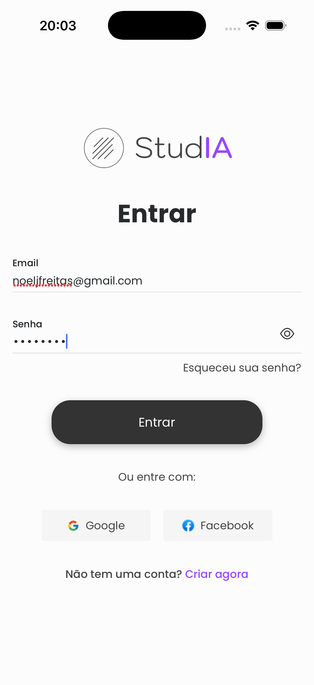
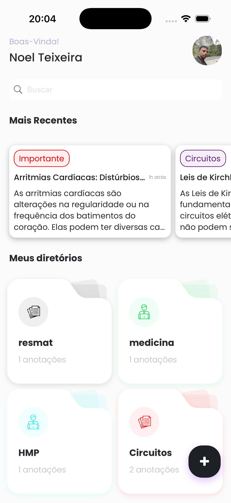
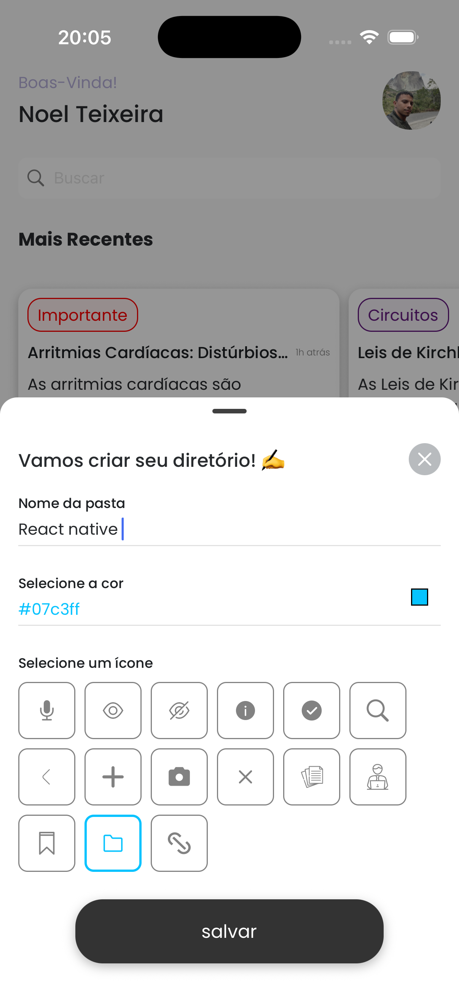
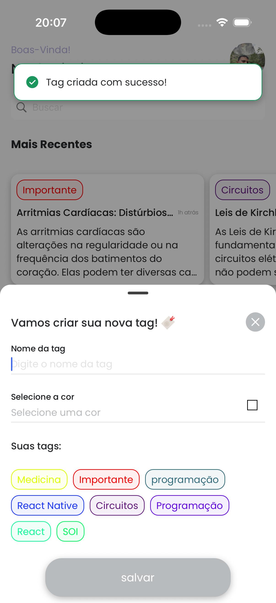
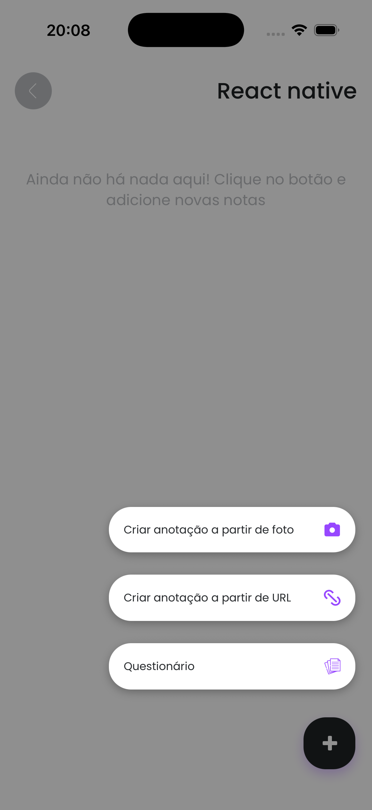
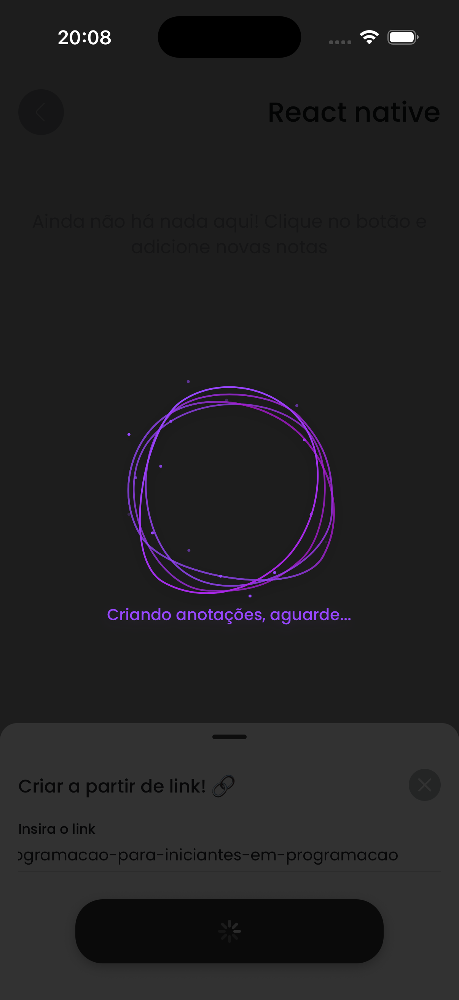
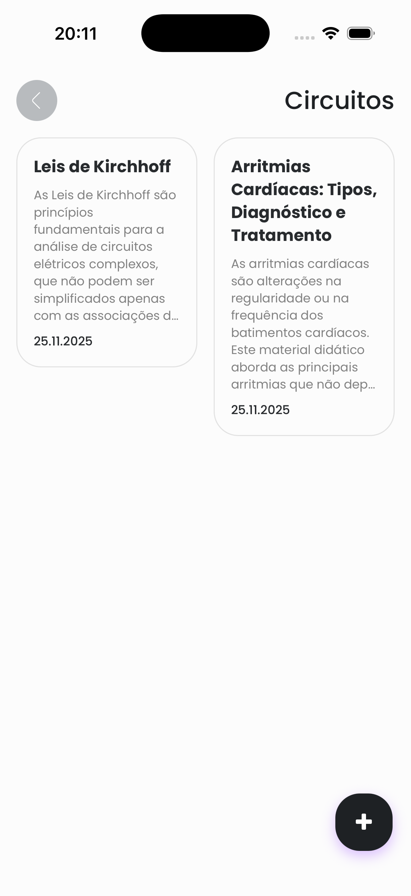

# Studia – Assistente Inteligente de Estudos

O **Studia** é um aplicativo mobile desenvolvido em **React Native** como parte do meu **Trabalho de Conclusão de Curso (TCC)**.
Ele foi criado para ajudar estudantes a organizar conteúdos, extrair informações de livros e sites e transformar essas informações em anotações inteligentes e facilmente acessíveis.

## 📚 Objetivo do Projeto

O Studia tem como propósito apoiar estudantes na etapa de **estudo, organização e revisão de conteúdos**.
A proposta do app é unir tecnologia e educação, oferecendo ferramentas práticas que aceleram a aprendizagem e reduzem o esforço manual.

---

## ✨ Funcionalidades Principais

### 📝 Resumo de Conteúdos

O usuário pode enviar imagens ou URLs de páginas web para que o app gere **resumos**, facilitando o entendimento.

### 🗂️ Estrutura de Notas

O app permite:

- Criar e editar notas
- Criar diretórios de estudos
- Criar tags para organização de dados
- Criar notas a partir de URL ou imagem
- Gerar questionários por diretórios

### 🤖 Como foi feito

Utilizamos como backend o serviço do Xano para otimizar tempo, juntamente com um agente de IA no N8N para criar as anotações no formato desejado.

---

## 🛠️ Tecnologias Utilizadas

- **React Native** (Expo Bare Workflow)
- **TypeScript**
- **Backend conectado a modelos de linguagem**

---

## 📸 Imagens do Projeto

Exemplo:

